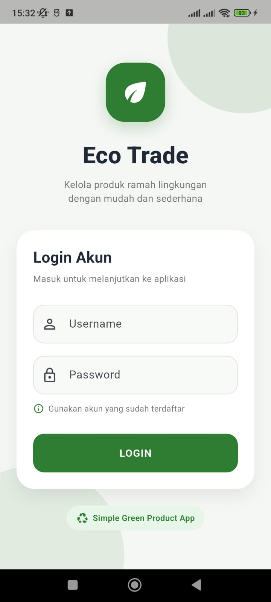
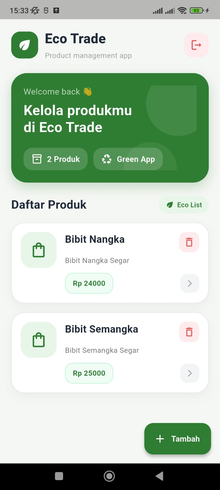
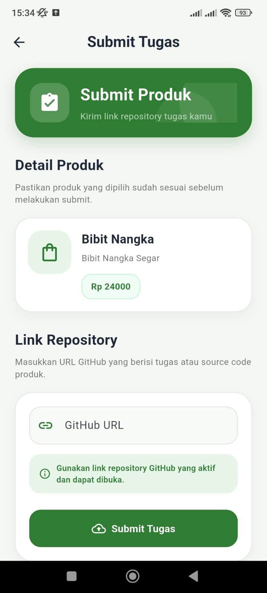
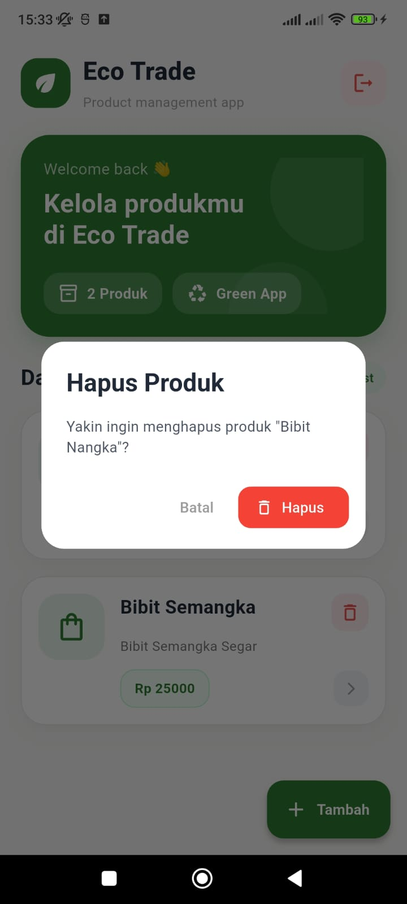

# Eco Trade - Tugas Praktikum PBM

Eco Trade adalah aplikasi mobile berbasis Flutter untuk manajemen produk sederhana yang terintegrasi dengan API. Aplikasi ini memiliki fitur login, menampilkan daftar produk, menambahkan produk baru, menghapus produk, logout, serta submit tugas menggunakan link GitHub.

## 📱 Tentang Aplikasi

Aplikasi Eco Trade dibuat sebagai tugas praktikum Pengembangan Berbasis Mobile (PBM).  
Konsep aplikasi ini mengangkat tema pengelolaan produk ramah lingkungan dengan tampilan sederhana, rapi, dan mudah digunakan.

## ✨ Fitur Aplikasi

- Login menggunakan akun dari API
- Menampilkan daftar produk dari API
- Menambahkan produk baru
- Menghapus produk
- Refresh daftar produk
- Submit tugas menggunakan GitHub URL
- Logout dari aplikasi
- Tampilan UI sederhana bertema hijau / eco-friendly

## 📸 Screenshot Aplikasi

Berikut adalah tampilan UI dari aplikasi Eco Trade:

### 1. Autentikasi

| Login Screen |
| :---: |
|  |

### 2. Tampilan Utama

| Home / Dashboard |
| :---: | :---: |
|  |  |

### 3. Fitur Produk

| Tambah Produk |
| :---: | :---: |
|  |  |

### 4. Pop-up Konfirmasi

| Konfirmasi Hapus Produk |
| :---: | :---: |
|  |  |

### 5. Submit Tugas

| Submit Tugas |
| :---: |
|  |

## 🔗 API yang Digunakan

Aplikasi ini menggunakan API dari:

```txt
https://task.itprojects.web.id/api
